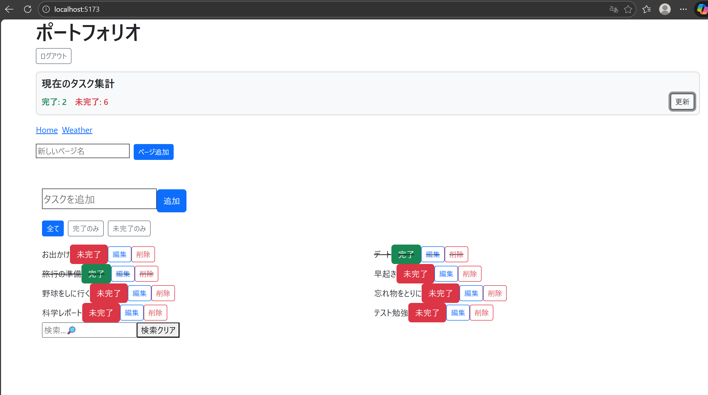
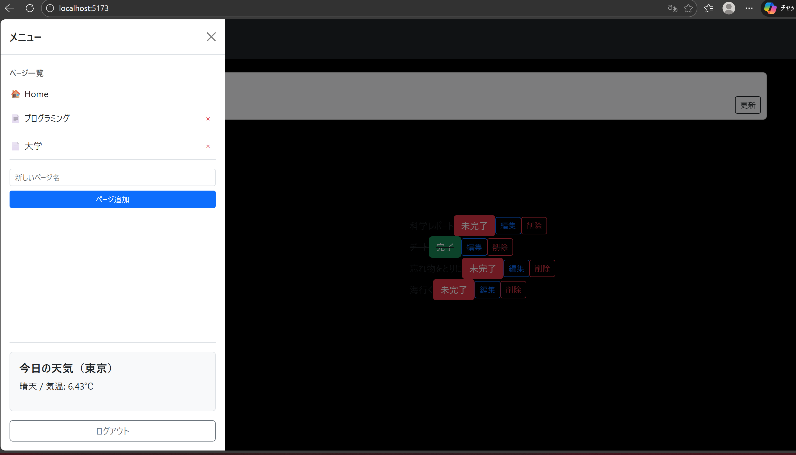

## ToDo + 天気要素アプリ 

インターン経験を基に作成した ToDo アプリです。
Supabase を使ったタスク管理機能、ログイン機能に加えて、OpenWeather API を利用した「天気表示」を実装しています。
ログイン履歴の記録・タスク統計の集計が可能です。
Cypressを用い、タスク操作やログインの流れなどを自動テスト。
React / TypeScript を中心に、状態管理・ルーティング・API連携・認証を一通り経験することを目的に開発しました。

## 見た目

## 機能
- ToDo の追加・編集・削除
- フィルタリング（全て / 完了 / 未完了）
- タスクの検索
- ページ追加,削除
- OpenWeather API で天気を取得
- ログイン履歴の記録
- タスクの統計表示

## 認証機能
- Supabase Auth を利用したログイン / 新規登録
- ログインなしでもアプリ利用可能
- ログイン時はユーザーごとにデータを分離

## 自動テスト (Cypress) の設計方針
タスク追加時の不具合や、他人に勝手に操作されるなど、リスクベースの観点から優先度が高いと考えたものを以下のようにテスト設計しました。jstqbで学んだ内容を個人開発に当てはめる形にしています

・境界値分析: タスク追加時のバリデーション

  検証内容: 0文字、1文字、30文字、31文字

  意図: UI崩れや、タスクを追加するというメイン機能で不具合がリスクがあるため、最も重要な箇所だと考えました
    最小限の工数でテストするために境界値で実装

・状態遷移テスト: タスクのライフサイクル

  検証内容: 「未完了 → 完了 → 削除」の流れ

  意図：単発の操作ではなく、一連の流れ（ライフサイクル）が壊れていないかを検証するため。「削除できない」、「編集できない」という不具合は、ユーザーの使用感に与える影響が大きいと考えました。

・異常系テスト

  検証内容: 未ログイン状態での操作ブロックや、不正な入力に対するアラート表示

  意図: 未ログイン時の不正な操作はアプリの信頼性を失うため。安全性に関わる問題なので重要度高いと考えました。

・外部API（OpenWeather）を利用した箇所のテスト

  意図: 環境変化で上手くいかなくなる事が多かった経験から、壊れやすい箇所と判断

今後の課題

• テスト遷移図の作成： 現在は個人の簡単なアプリなので理解可能ですが、実務で扱うような複雑なアプリでの場合やチームの理解のために、遷移図が必要になると考えたため

## 工夫した点 / 学び
- Supabase,Expressを使ってフルスタックな構成に
- API Key を `.env` ファイルで管理
- UI/UX 改善のため検索やフィルタリング、未ログイン時に操作しようとした際のア　ラート誘導など
- 文字数制限は境界付近で不具合が発生しやすいため、境界値を重点的に検証
- ログインは認証状態の不具合がリスクにつながるため、優先的にテスト
- 外部API連携は、APIキーの設定漏れや、環境移行などによる環境依存の不具合が多かったため、テストするべき箇所だと判断

## 今後やりたいこと
- 更なるテスト理解
- UI改善やデザイン向上
- 実務経験
- 資格の勉強

## 使用技術
- TypeScript
- React(useEffect + useReducer + React Router)
- Vite
- Bootstrap 5
- Axios
- Supabase
- OpenWeather API
- Node.js express
- vitest + React Testing Library
- Cypress

## セットアップ手順
1. リポジトリを clone
 bash
git clone https://github.com/SogoTahara/todo_portfolio.git
cd todo_portfolio

2. インストール
npm install

3. 環境変数の設定
VITE_SUPABASE_URL=あなたのSupabaseのURL
VITE_SUPABASE_ANON_KEY=あなたのSupabaseのAnon Key
VITE_OPENWEATHER_API_KEY=あなたのOpenWeather API Key

4. 起動
・サーバー起動
　node index.js

・フロントエンド起動
　npm run dev
　http://localhost:5173 にアクセス

## リンク(Vercelでデプロイした動作確認ページ)
https://todo-react-git-main-sougos-projects-21194172.vercel.app?_vercel_share=1SJlTwKEj6fidNNj16YfoSbUF13xPEqN

## 作者
大学2年 / エンジニア志望  

